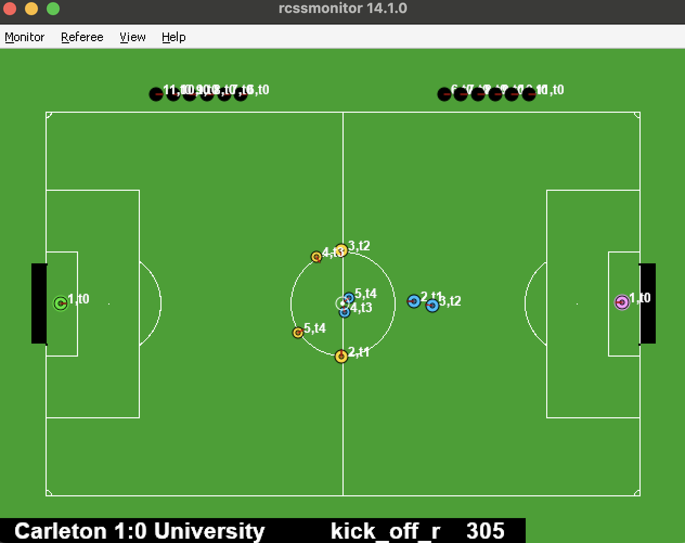

# RoboCupAgent

This project demonstrates an implementation of a [JASON](https://jason-lang.github.io/) BDI agent that plays in the [RoboCup 2D Simulator](https://ssim.robocup.org/).

<p align="center">
    
</p>

## Contributors
- [Aron Arany-Takacs](https://github.com/aranyszivu)
- [Bardia Parmoun](https://github.com/bardia-p)
- [Dylan Leveille](https://github.com/DylanLeveille)

## Project Design

Please review our [report](documents/Robocup_Report.pdf) detailing the design of this project.

In addition, you can view our group presenting this design by following the [presentation](documents/RobocupPresentation.pdf).

## Running the Program

To see a demo of the RoboCup team play against itself run:

On Unix:
```bash
./TeamStart.sh
```

On Windows:
```bash
.\TeamStart.bat
```

or simply double-click on the bat file!

### Contest Mode
To run the team in contest mode you will just need to load half of the team. To do that use the `HalfTeamStart` files.

On Unix:
```bash
./HalfTeamStart.sh
```

On Windows:
```bash
.\HalfTeamStart.bat
```